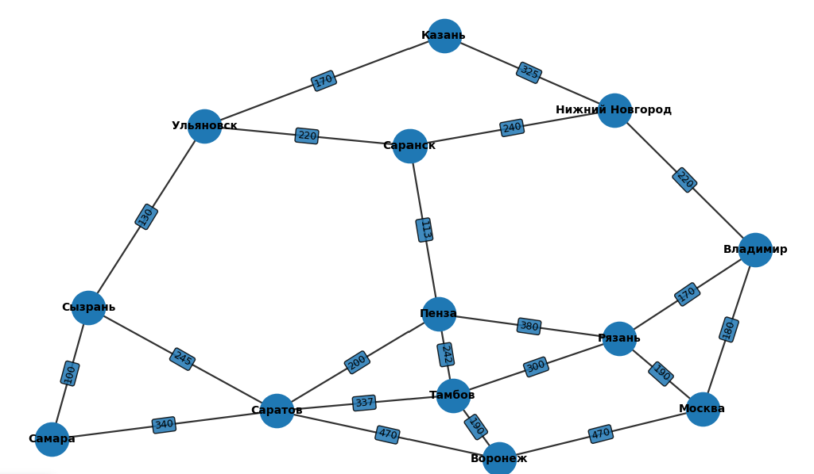

# Logistics Route Calculation System

Система для расчёта кратчайших маршрутов между городами на основе алгоритма Дейкстры.  
Проект включает граф городов получаемый из базы данных, сервисы вычисления пути и REST-контроллер для получения
результата через API.

##  Описание проекта

Приложение реализует логику построения графа городов (вершины + рёбра), а также поиск кратчайшего маршрута между двумя точками.  
Для расчёта используется классический алгоритм Дейкстры с приоритетной очередью.

Ниже представлен изначальный граф маршрутов между городами.
